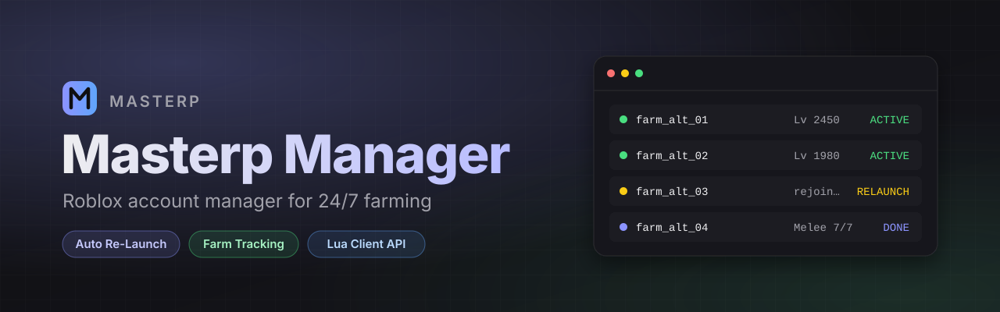

<p align="center">
  
</p>

<p align="center">
  
  
  
</p>

<p align="center">
  <b>Roblox account manager สำหรับฟาร์ม 24/7</b><br>
  เปิดหลายบัญชีพร้อมกัน · Re-Launch อัตโนมัติเมื่อหลุด · ติดตามสถานะฟาร์มแบบเรียลไทม์
</p>

---

## ✨ Features

| Feature | รายละเอียด |
|---|---|
| 🔁 **Auto Re-Launch** | ตรวจจับบัญชีที่หลุด/ค้าง แล้วเปิดใหม่ให้อัตโนมัติ |
| 📊 **Farm Tracking** | สคริปต์ในเกมส่งสถานะกลับมาที่โปรแกรม และส่งออก Google Sheet ได้ |
| ✅ **Done Detection** | สคริปต์แจ้ง `Done` เมื่อฟาร์มครบ บัญชีถูกปิดและสลับตัวถัดไป |
| 🌐 **Server Join** | Join Low Server, VIP / Private Server |
| 🎨 **Themes** | หลายธีม ปรับฟอนต์และขนาดตัวอักษรได้ |

## 🚀 Quick Start

ใส่ loader ใน executor (auto-execute):

```lua
loadstring(game:HttpGet("https://raw.githubusercontent.com/Achitsak/masterp-manager/main/loader/client.lua"))()
```

ส่งสถานะจากสคริปต์ฟาร์มของคุณ:

```lua
_G.Masterp_Description("Level 200")   -- แสดงสถานะในโปรแกรม
_G.Masterp_Done()                     -- แจ้งว่าฟาร์มเสร็จแล้ว
```

📖 API ทั้งหมด (รวมการส่งข้อมูลขึ้น Google Sheet) → [`loader/README.md`](loader/README.md)

## 🎮 Profiles

สคริปต์สำเร็จรูปใน [`loader/profiles`](loader/profiles):

`AOTR` · `BLOCKSPIN` · `BLOXFRUIT` · `FISCH` · `GROWAGARDEN2`

## 📁 Structure

```
loader/
├── client.lua        # entry point (loadstring this)
├── README.md         # client API
├── profiles/         # per-game scripts
├── services/         # shared helpers (webhook, …)
└── automation/
```

---

<p align="center"><sub>Made by <b>Masterp</b></sub></p>
